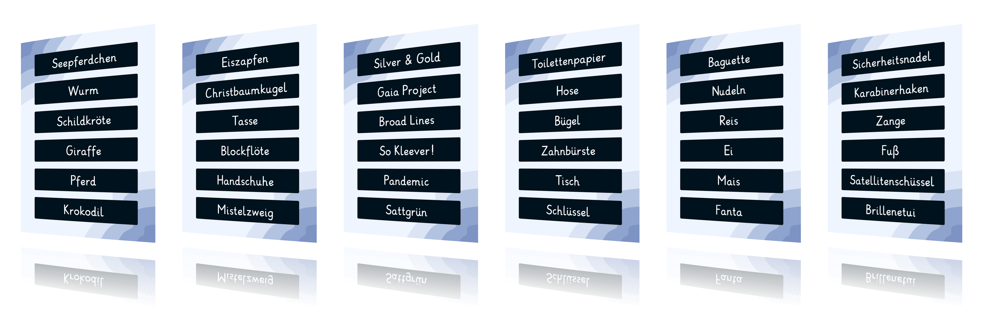
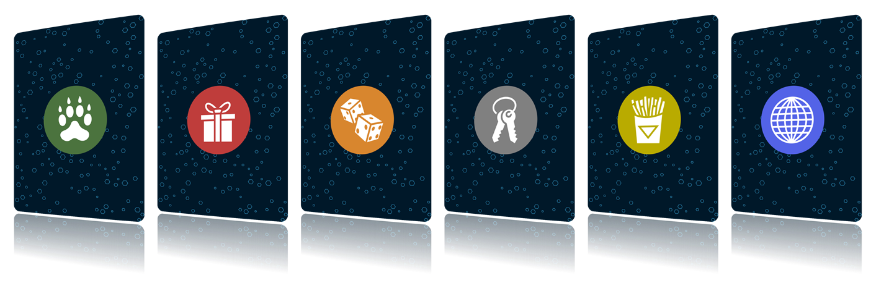

# german-word-card-deck

This repository is dedicated to creating playing cards with six words per card, suitable for various word games such as Broad Lines, Just One, etc.




If you want to read the process of creating and crafting the cards you can read this in [my blog post](https://markusdick.de/posts/creating-print-and-play-cards/).

## Download the Print and Play File
If you only want to use the latest print and play file you can find the file under [releases](https://github.com/markusdick/german-word-card-deck/releases).

## How to Use

To use this tool, you'll need the following dependencies installed on your system:

- [Ruby](https://www.ruby-lang.org/en/) with rake
- [Squib](https://squib.rocks/)
- Font: Grundschrift

### Instructions

1. Clone this repository to your local machine.

```bash
git clone https://github.com/markusdick/german-word-card-deck.git
cd german-word-card-deck
```

2. Edit the `words.csv` file with your desired words.

3. Install the font `.\assets\Grundschrift-Bold.otf`.

3. Run the following command to generate the playing cards in PDF format.

```bash
rake
```

4. The generated PDF file `deck.pdf` will be available in the `_output` directory.

## Contributing

If you'd like to contribute to this project, feel free to submit a pull request or open an issue.

## Credits
- Family ❤️ for brainstorming words, designs, crafting and proof reading

### Tools / Tutorials
- [Squib](https://squib.rocks) by Andy Meneely
- [How To Make Game Cards that Shuffle - Print and Play Tutorial](https://www.youtube.com/watch?v=DgNJmAkO1_M) by Rachel Bruner

### Icons
All icons are from [game-icons.net](https://game-icons.net/).

Category | Icon / URL | By | License
---------|----|----|---------
General|https://game-icons.net/1x1/delapouite/wireframe-globe.html | [delapouite](https://delapouite.com/) | [CC BY 3.0](https://creativecommons.org/licenses/by/3.0/)
Animals |https://game-icons.net/1x1/lorc/flat-paw-print.html | [lorc](https://lorcblog.blogspot.com/) | [CC BY 3.0](https://creativecommons.org/licenses/by/3.0/)
Christmas | https://game-icons.net/1x1/delapouite/present.html | [delapouite](https://delapouite.com/) | [CC BY 3.0](https://creativecommons.org/licenses/by/3.0/)
Board Games| https://game-icons.net/1x1/delapouite/rolling-dices.html | [delapouite](https://delapouite.com/) | [CC BY 3.0](https://creativecommons.org/licenses/by/3.0/)
Everyday objects |https://game-icons.net/1x1/delapouite/house-keys.html | [delapouite](https://delapouite.com/) | [CC BY 3.0](https://creativecommons.org/licenses/by/3.0/)
Food & Drink| https://game-icons.net/1x1/delapouite/french-fries.html | [delapouite](https://delapouite.com/) | [CC BY 3.0](https://creativecommons.org/licenses/by/3.0/)
Family | https://game-icons.net/1x1/lorc/two-shadows.html | [lorc](https://lorcblog.blogspot.com/) | [CC BY 3.0](https://creativecommons.org/licenses/by/3.0/)

### Font
The project uses the font "Grundschrift" by [Christian Urff](https://www.urff.info/) under the [CC BY 3.0](https://creativecommons.org/licenses/by/3.0/).

## License
The code is licensed under the [MIT License](./LICENSE). The [german wordlist](./words.csv) is licensed under the [CC BY-SA 4.0 DEED](https://creativecommons.org/licenses/by-sa/4.0/deed).